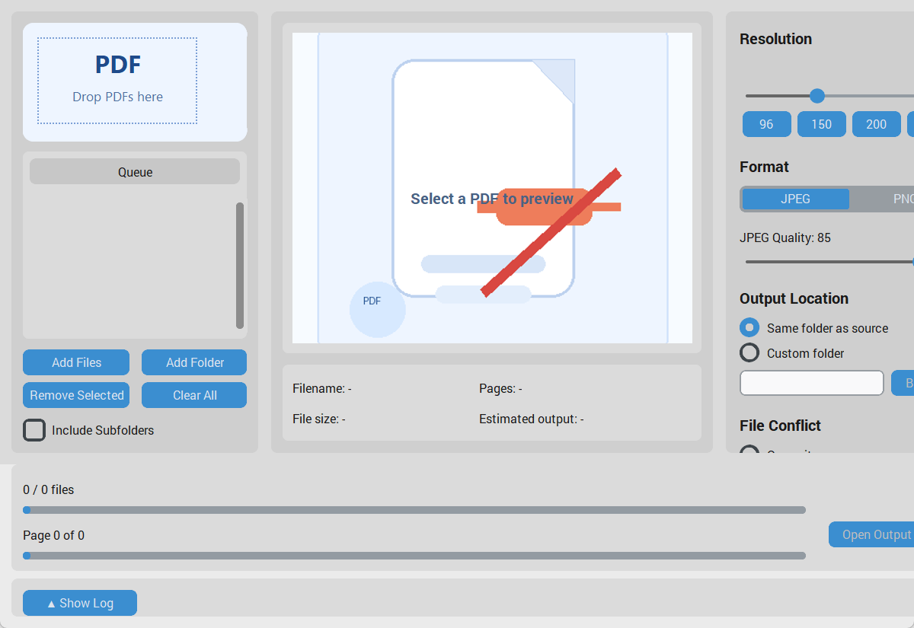

# PDF Deinjection

A Windows desktop app that rasterizes PDFs into image-only PDFs to remove hidden text layers, metadata, and embedded prompt injection content.

## Motivation

Many PDFs can contain hidden prompt injection text, invisible layers, or metadata intended to manipulate LLM-based workflows. PDF Deinjection removes that hidden content by rendering each page into a plain image and rebuilding a clean PDF from those rasterized pages.

## Installation

1. Install Python 3.10 or newer.
2. Install uv: `pip install uv`
3. Clone the repository.
4. Sync the project environment:

```bash
uv sync
```

5. Launch the app in GUI mode:

```bash
uv run python main.py --gui
```

## Usage

### GUI

```bash
uv run python main.py --gui
```

- Drag PDF files or folders into the left queue panel, or use `Add Files` / `Add Folder`.
- Select a file to preview its first page.
- Adjust DPI, output format, JPEG quality, output folder, and conflict mode from the right panel.
- Click `START` to begin rasterizing queued files.
- Click `CANCEL` to stop a running batch. Partial output for the in-progress file is removed automatically.

### CLI

```bash
uv run python main.py input.pdf --dpi 150 --format JPEG --quality 85 --conflict auto-rename
```

Examples:

```bash
uv run python main.py report.pdf
uv run python main.py papers --include-subfolders --format PNG
uv run python main.py a.pdf b.pdf --output-dir converted --conflict overwrite
```

CLI options:

- `--gui`: force desktop mode
- `--dpi`: render resolution from 72 to 300
- `--format`: `JPEG` or `PNG`
- `--quality`: JPEG quality from 1 to 100
- `--output-dir`: custom output folder
- `--conflict`: `overwrite`, `skip`, or `auto-rename`
- `--include-subfolders`: recursively scan folder inputs for PDFs

### Build EXE

```bash
build.bat
```

Generated files:

- `dist/PDF Deinjection.exe`: GUI application
- `dist/pdf-deinjection-cli.exe`: CLI application

## Features

- Windows desktop GUI built with CustomTkinter
- CLI mode for scripted or batch workflows
- PDF rasterization powered by PyMuPDF
- JPEG or PNG intermediate encoding
- Automatic output naming with `_deinjected` suffix
- Conflict handling: overwrite, skip, or auto-rename
- Queue preview with first-page thumbnail
- Persistent config saved in `config.json`
- Cancel support with partial-file cleanup
- uv-managed environment and PyInstaller packaging

## Screenshot



## License

MIT
